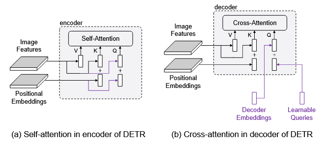
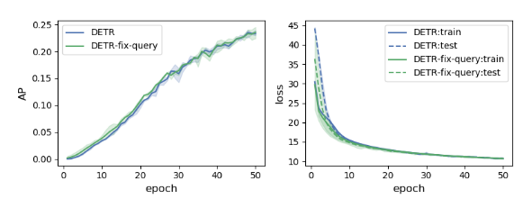
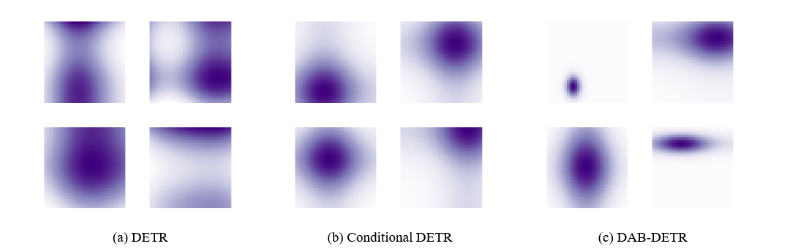
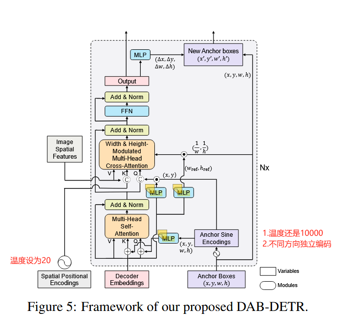
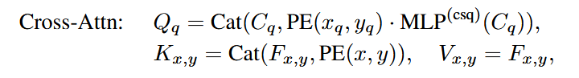
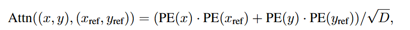
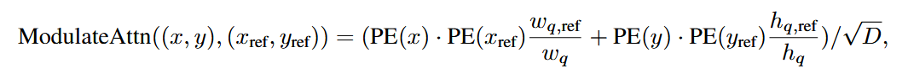

## 1 Query的角色



先来回顾一下query是什么，上图是encoder中self-attention和decoder中cross-attention的对比图，可以发现唯一的区别在于query的组成。对于encoder的self-attention，query=image features（内容） + positional embeddings（位置），所以对应到decoder来说，decoder embeddings就是content，learnable queries就是position。

对于decoder embedding，它担当一个“语义载体”的身份，它是不可学习的，它通过cross attention和image feature进行交互，并将注意力施加到values中（也是image features）,从而抽取语义信息。

对于learnable queries，它是可学习的，也是通过cross attention进行交互（不断地看图像中的某个东西），最后由目标损失函数反向传播回来的梯度进行更新，理应要学习到物体的所在位置。

## 1.1 Query的不好

Encoder中的query是图像特征+正余弦编码，我们知道decoder embedding初始化为0，learnable queries又没有显示提供位置先验，因此刚开始做注意力时，大多数decoder embeddings都会被project到图像特征的同一空间位置（learnable queries没有约束之），DETR势必要经过多轮才能训练得当。

错在learnable queries，但是到底是learnable queries难以学习，还是说它没有提供显示位置先验，才让整个训练过程漫长呢？



由改图可知，拿了已训练好的DETR的learnable queries并将其固定住，然后重新训练DETR的其他部分，除了在前几个epochs的loss会小一点，整体过程都后面跟原始learnable queries的DETR差不多。所以说learnable queries容易学习（后面的过程大家都差不多，说明以及学习得很像了），但也拦不住DETR训练慢。所以不免猜测为第二个原因：没有提供显式位置先验。



将learnable queries与encoder中的positional embedding进行点乘，然后可视化之，可以发现，注意力图中要不会出现多个中心点，要不就是注意力面积过大或过小，也就说明learnable queries并没有很好的在位置上进行约束。既比如如果图中有多个objects，那么query就不知道该看哪个。又或者是看的不全或看的太杂，总之一点用都没有。图(b)则是加入了位置先验后的点乘得出的注意力图，可以发现注意力明显好多了。

所以可以推出：queries的多模式（multiple mode)是导致训练漫长的罪魁祸首，并且加入位置先验是可以有效提高训练速度的。

但是图(b)也有不合理的地方，因为不同的objects的尺度必然是不同的，因此加入尺度信息也是应该的，如图(c)所示。

## 2 Anchor boxes/Reference points

所以本文提出了anchor boxes作为learnable queries，既$A_q=(x_q,y_q,w_q,h_q)$表示第q个anchor box。整体模型如图所示



### 2.1 各个组件

- Decoder中self-attention的Q、K的位置编码
  
  它由reference points（也就是anchor boxes）经过Anchor Sine Encoding（源码中的gen_sineembed_for_position）得到四个方向独立的正余弦编码后，在经过一层MLP（主要作用是变换维度，源码中的ref_point_head）得到。需要注意的是，这里的温度还是10000.

- Decoder中self-attention的输入
  
  ```python
   if not self.rm_self_attn_decoder:
              # Apply projections here
              # shape: num_queries x batch_size x 256
              q_content = self.sa_qcontent_proj(tgt)      # target is the input of the first decoder layer. zero by default.
              q_pos = self.sa_qpos_proj(query_pos)
              k_content = self.sa_kcontent_proj(tgt)
              k_pos = self.sa_kpos_proj(query_pos)
              v = self.sa_v_proj(tgt)
  
              num_queries, bs, n_model = q_content.shape
              hw, _, _ = k_content.shape
  
              q = q_content + q_pos
              k = k_content + k_pos
  
              tgt2 = self.self_attn(q, k, value=v, attn_mask=tgt_mask,
                                  key_padding_mask=tgt_key_padding_mask)[0]
  ```

        可见不管是q,k,v还是position,content，都是要先进行Linear project，然后此时content和pos是相加

- Decoder中cross-attention的x,y transformation
  
  这里的作用更多是获取以内容信息为条件的尺度向量（既让尺度向量看到内容信息，再加以调整之后，得到新的尺度向量）。需要注意的是，第一层传过来的是tgt被初始化为0，并没有什么内容信息，所以第一层不做transformation。既以下公式的$\text{MLP}^{(csq)}$
  
  
  
  ```python
              if self.query_scale_type != 'fix_elewise':
                  if layer_id == 0:
                      pos_transformation = 1
                  else:
                      pos_transformation = self.query_scale(output)
              else:
                  pos_transformation = self.query_scale.weight[layer_id]
  
              # apply transformation
              # 注意这里做了截断，在最后一维截取前 d_model 个维数
              query_sine_embed = query_sine_embed[...,:self.d_model] * pos_transformation
  ```

- Decoder中cross-attention的尺度调节
  
  这是原本两个位置编码的attention
  
  
  
  这是加入了尺度调节后的attention
  
  
  
  具体代码实现如下：
  
  ```python
              # modulated HW attentions
              # 将尺度信息注入交叉注意力这一步骤是在attention之前完成的
              if self.modulate_hw_attn:
                  refHW_cond = self.ref_anchor_head(output).sigmoid() # nq, bs, 2，对应w_{q,ref} & h_{q,ref}
                  query_sine_embed[..., self.d_model // 2:] *= (refHW_cond[..., 0] / obj_center[..., 2]).unsqueeze(-1)
                  query_sine_embed[..., :self.d_model // 2] *= (refHW_cond[..., 1] / obj_center[..., 3]).unsqueeze(-1)
  ```

              output = layer(output, memory, tgt_mask=tgt_mask,
                             memory_mask=memory_mask,
                             tgt_key_padding_mask=tgt_key_padding_mask,
                             memory_key_padding_mask=memory_key_padding_mask,
                             pos=pos, query_pos=query_pos, query_sine_embed=query_sine_embed,
                             is_first=(layer_id == 0))

```
- 位置偏移

- 每一层decoder的输出都会经过MLP（bbox_embed）得到偏移量，然后加入到当前的reference points中去更新。最后一层会在外部进行。

- bbox_embed分为两种，共享权重以及每一层独立

  代码细节如下：

  ```python
  # decoder 层
             # iter update
              # 更新参考点
              if self.bbox_embed is not None: # 生成offsets
                  if self.bbox_embed_diff_each_layer:
                      tmp = self.bbox_embed[layer_id](output) # 独立
                  else:
                      tmp = self.bbox_embed(output)   # 共享
                  # import ipdb; ipdb.set_trace()
                  tmp[..., :self.query_dim] += inverse_sigmoid(reference_points)  # 参考点是经过了sigmoid的，先反sigmoid
                  new_reference_points = tmp[..., :self.query_dim].sigmoid()  # 更新参考点后重新经过sigmoid缩放
                  if layer_id != self.num_layers - 1:
                      ref_points.append(new_reference_points) # 最后一层的参考点会在外层模型由整个transformer的output经过bbox_embed得到offsets
                  reference_points = new_reference_points.detach()    ## 作者说(本人说的哦) detach() 是因为让梯度的流通更友好，它想让每层的梯度仅受该层的输出影响
  ```

  ```python
        # 外层
          # iii. 预测每个对象(query)的位置：
          # 基于它们的参考点(位置先验)，然后将它们的隐层向量输入 bbox_embed 得到校正的偏移量，
          # 最后由参考点+偏移量得到位置：x,y,w,h
          if not self.bbox_embed_diff_each_layer:
              reference_before_sigmoid = inverse_sigmoid(reference)
              tmp = self.bbox_embed(hs)
              tmp[..., :self.query_dim] += reference_before_sigmoid
              outputs_coord = tmp.sigmoid()
          else:   # 如果每一层的bbox_embed不共享
              reference_before_sigmoid = inverse_sigmoid(reference)
              outputs_coords = []
              for lvl in range(hs.shape[0]):  # 对于每一层，hs都要和该层的bbox_embed做
                  tmp = self.bbox_embed[lvl](hs[lvl])
                  tmp[..., :self.query_dim] += reference_before_sigmoid[lvl]
                  outputs_coord = tmp.sigmoid()
                  outputs_coords.append(outputs_coord)
              outputs_coord = torch.stack(outputs_coords) # (num_layers,bs,num_queries,4)
  ```


- 

- 其他细节

- 尺度调节实在传入到cross-attention之前进行的

- 在输入到cross-attention时，会将其进行concat而不是相加，这样content和position的注意力就会分开计算

- 这里对于reference points取消了梯度，这样的话可以避免reference points过拟合当前数据集的尺寸分布，因为偏移量也是可以修正reference points的。
```
