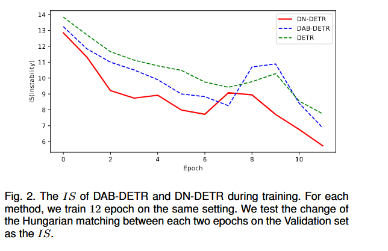
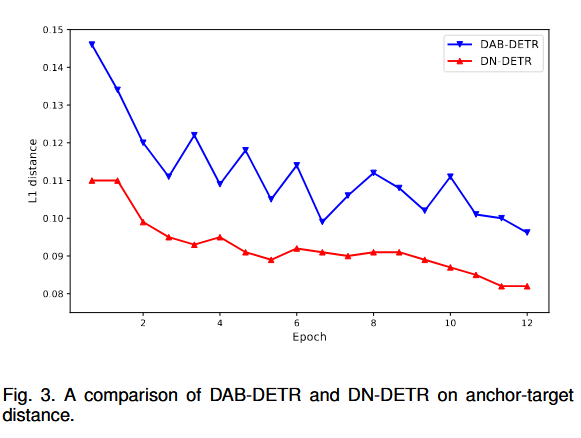
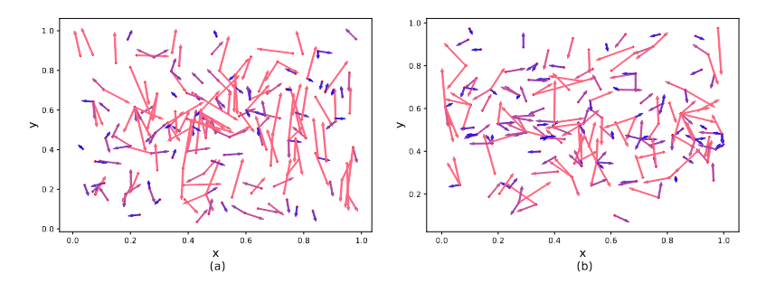
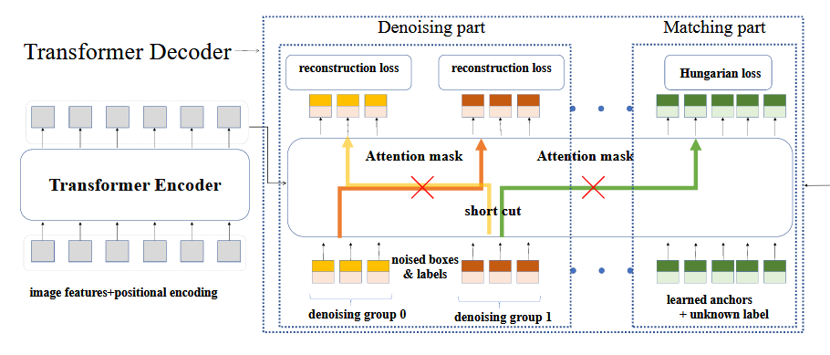
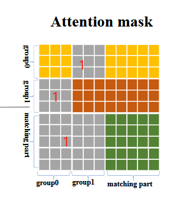

## 1 Motivation

论文对DETR的二分图匹配下手，指出二分图匹配是一个动态且不稳定的过程，故影响了训练的效率。众所周知二分图匹配是最优化cost matrix来找到最优匹配（match指query和gt object一一对应），但是训练前期，匹配肯定是瞎猜来着，矩阵内的损失稍有变化，最优匹配也就发生变化了，就导致训练收敛慢了。那为什么匹配变了训练就慢呢？

DETR-like的模型基本上是two-stage的，第一阶段就是“learn good anchors“，也就是找到query-gt box的match；第二阶段是”learn relative offsets“，也就是负责微调bounding box。你第一阶段都搞不好，第二阶段也别想搞好了。本来你负责微调query1-gt box1，下一个epoch又去微调query1-gt box2🙄

So 本文提出denoising task作为训练的捷径，基本上就是多一项任务让matching的任务更顺利完成然后就能尽早去学习偏移了吧。


## 2 Why denosing can help?

### 2.1 稳定二分图匹配

论文提出了一个指标$IS$来负责表现denoising任务对于稳定二分图匹配是有效的。

假设decoder预测的objects为$\text{O}^\text{i}=\{O_0^i,..,O_{N-1}^i\}$，其中$i$为第i-th个epoch，$N$为预测的objects的个数。又设真实object为$\text{T}=\{T_0，..T_{M-1}\}$,其中$M$为真实objects的个数。计算index vector $\text{V}^\text{i}=\{V_0^i,...,V_{N-1}^i\}$来第i-th epoch的存储匹配结果。

$$
V^i_n = 
\begin{cases} 
m, & \text{if } O^i_n \text{ matches } T_m \\ 
-1, & \text{if } O^i_n \text{ matches nothing}
\end{cases}


$$

那么$IS^i=\sum_{j=0}^N\mathbb{1}(V_n^i\not = V_n^{i-1})$

直白来说，就是第n-1个epoch，预测的$O_{n-1}^i\text{ match }T_5$，既第i个qurey对应第5个gt object，下一轮预测的$O_n^i\text{ match } T_4$，那么 $IS^i$记为 1，既前一轮跟后一轮预测的索引不同。结果如下图所示，denoising任务确实有用，但为什么，unknown..



### 2.2 更局部地query search

从DETR的论文可以知道，positional queries有多种operating modes，导致query search是在一个偏大的范围内进行的。DN-DETR在原始anchor（positional queries)和targets之间有更短的平均距离。一种解释就是denosising tasks使得模型能够去重建bounding box，所以可以让query search更局部，这样每个query的关注点也会在附近，减小与其他queries的冲突预测。我感觉是一个毫无解释的解释。



下面的图展示了训练的难度，越长则是训练难度越大。




## 3 DN-DETR method

上帝视角版:

DN-DETR要做两个任务，一个是match task，另一个是denoising task，这两个tasks都是用queries做的，queries之间是独立的，比如前50个queries做denoising task，后300个queries做matching task。而noise queries是从match queries中采样来的，然后对labels和box加噪形成。然后一同送入transformer，并配置专用的attention mask，得到输出后，分别做正常的检测任务以及重建任务。


当我们forward到transformer前，就要构建noise queries和改变match queries。

### 3.1 Bounding Box加噪

对（x,y,w,h）分别加噪，其中(x,y)表示边界框中心，(w,h)表示边界框的高和宽。

对于中心坐标，论文指出给(x,y)增加随机噪声($\Delta x,\Delta y$) ，且确保$|\Delta x|<\frac{\lambda_1w}{2};|\Delta y|<\frac{\lambda_1h}{2}$，实验设置$\lambda_1=0.2$时效果最佳。这样可以确保增加噪声后，中心坐标仍然在边界框内。

对于边界框高宽，则随机在$[(1-\lambda_2)w,(1+\lambda_2)w]$采样$w$，$h$的采样也一样。

但是下边源码的做法时，从[0,1]中均值采样后，乘上2减去1，然后再乘以$\lambda_2$使得值域变为$[-0.4,0.4]$，然后乘以(x,y,h,w)

```python
 if box_noise_scale > 0:     # lambda 2 = 0.4
    diff = torch.zeros_like(known_bbox_expand)  # 构建一个known_bbox_expand同样大小的全0矩阵，用来放中心坐标和高宽
    diff[:, :2] = known_bbox_expand[:, 2:] / 2  # 中心点坐标 (w/2, h/2)，原本的coco数据集的(x,y)是左上角坐标,还是不太了解coco数据集
    # 在原 gt boxes 上加上偏移量，并且保证加噪后框的中心点在原来的框内
    # torch.rand_like(known_bbox_expand) * 2 - 1.0 的值域是 [-1,1), 乘上lambda 2后为 [-0.4,0.4],未超过0.5，所以坐标中心还在边界框内
    known_bbox_expand += torch.mul((torch.rand_like(known_bbox_expand) * 2 - 1.0),
                                           diff).cuda() * box_noise_scale
    known_bbox_expand = known_bbox_expand.clamp(min=0.0, max=1.0)   # 限制范围
```


### 3.2 Labels的加噪

Query包含content和position部分，所以理应来说，content也需要加噪。原本DAB-DETR中，content部分对应的是decoder embedding，他是不可学习的仅作为语义载体。labels进行加噪肯定不是简单地将label为1的变成label=8就行。所以论文里设置了一个class embedding，然后将label序号传入到embedding中进行一个look up的操作，得到对应的label vector来表示label。

源码的加噪做法是，随机抽取indices，然后在[0, num_class-1]中随机生成跟indices尺寸一致的new label,然后再将得到的(indices, new labels) 代替对应位置的GT labels

```python
if label_noise_scale > 0:   # lambda 1 = 0.2 
    p = torch.rand_like(known_labels_expaned.float())   # 从均匀分布中采样shape为 known_labels_expaned.shape的浮点数,表示概率
    chosen_indice = torch.nonzero(p < (label_noise_scale)).view(-1)  # 被选中的gt objects的索引，要向里面加噪了
    new_label = torch.randint_like(chosen_indice, 0, num_classes)  # 生成形如chosen_indice的tensor，并随机选择[0,num_classes]中任意类别作为噪声类别
    known_labels_expaned.scatter_(0, chosen_indice, new_label)  # 在 dim0 中使用 (chosen_indice,new_label)作为索引-值，写入到known_labels_expaned对应位置
```

### 3.3 DN Groups

为了增加denoising efficiency，设置多个denoising groups，每个groups施加不同程度的噪声，有点one-to-many的意思。分组的步骤其实是在加噪之前进行，先进行分组，然后再去加噪。

基本上进行`repeat`操作即可，但是要注意索引是如何利用起来的。

```python
    ### ---------------  2） 分配noise queries标签 -------------------------- 
    if training:
        known = [(torch.ones_like(t['labels'])).cuda() for t in targets]    # known:list[list] ,value均为1，内部list长度为每张图像的的object个数,外部list长度为batch size
        know_idx = [torch.nonzero(t) for t in known]    # # torch.nonzero() 返回张量中不为0的索引，比如[[0],[1],[2]],搞不懂什么作用
        known_num = [sum(k) for k in known] # 每张图的GT Objects个数
        # you can uncomment this to use fix number of dn queries
        # if int(max(known_num))>0:
        #     scalar=scalar//int(max(known_num))

        # 2.1 以下部分是对gt object在整个batch中计算索引
        unmask_bbox = unmask_label = torch.cat(known)   # (batch_obj,1)，值为1
        known_indice = torch.nonzero(unmask_label + unmask_bbox)# (batch_obj,1)，值为每个obj在整个batch的索引号
        known_indice = known_indice.view(-1)    #(batch_obj)
        known_indice = known_indice.repeat(scalar, 1).view(-1)  #  obj在整个batch的索引复制到所有denosing group, #(batch_obj * num_group)，比如这里是[50];

        # 2.2 准备 gt labels和 gt boxes
        labels = torch.cat([t['labels'] for t in targets]) # (batch_obj,1)，值为每个obj的类别索引
        boxes = torch.cat([t['boxes'] for t in targets])    # # (batch_obj,4)，值为每个obj的边界框
        batch_idx = torch.cat([torch.full_like(t['labels'].long(), i) for i, t in enumerate(targets)])  # obj所在图像索引号

        known_labels = labels.repeat(scalar, 1).view(-1)    # obj的labels复制到整个dn groups
        known_bid = batch_idx.repeat(scalar, 1).view(-1)    # obj的所在图像的索引复制到整个dn groups
        known_bboxs = boxes.repeat(scalar, 1)   # obj的bbox坐标复制到整个 dn groups

        known_labels_expaned = known_labels.clone() # 复制一份，用于加噪
        known_bbox_expand = known_bboxs.clone()
```

标签分配（假设image1有3个objects，image2有2个objects）：

- ``known``表示batch内每张图像的objects个数，比如[[1,1,1],[1,1]] 表示image1三个objects，image2两个objects

- ``known_indice``表示所有objects在整个batch的索引，如[0,1,2,3,4]。然后使用repeat操作复制到整个dn groups上，如果dn groups为5个，则复制在第0维5次，shape为[5,5]

- ``labels``和``boxes``都是从gt objects的annotation中提取

- ``batch_idx``表示objects所在的图像索引，比如[0,0,0,1,1]

- 复制到所有dn groups


目前为止，总览图如下



### 3.4 Attention mask

二分图匹配（match part）是根据类别、边界框的L1和GIoU Loss去得到最优匹配的，而noise query是从真实objects中采样然后加噪而来，所以自身是带有边界框信息（类别信息可能有可能没有），所以match attention就不应该看到noise query的信息，所以要mask掉。同理，不同queries之间也不能透露信息。



所以attention mask设计为：（灰色部分为1，表示看不见）

- matching parts看不见noise parts

- 不同的noise groups互相看不见


然后就可以输入进transformer中，输出output之后，切割开output，分别去计算不同的Loss（相当于做不同的任务），就大功告成了。


## 参考

Paper Link🔗[[2203.01305] DN-DETR: Accelerate DETR Training by Introducing Query DeNoising (arxiv.org)](https://arxiv.org/abs/2203.01305)

[1] [DN-DETR: 把去噪训练引入到 DETR 中打辅助，从而加速收敛 - 知乎 (zhihu.com)](https://zhuanlan.zhihu.com/p/578548914)
